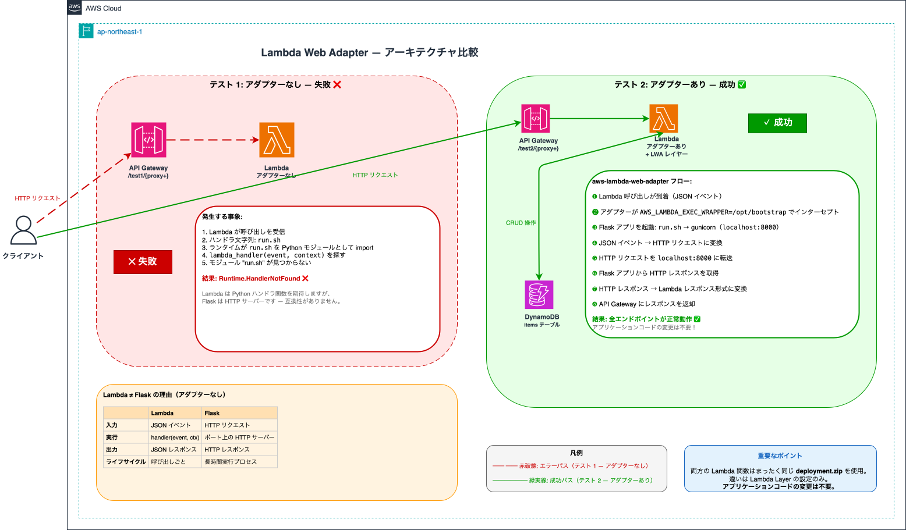

# Lambda Web Adapter 移行テスト



## プロジェクト概要

本プロジェクトは、**aws-lambda-web-adapter** を使用することで、標準的な Flask Web アプリケーションを **アプリケーションコードの変更なし** で AWS Lambda 上で動作させられることを実証するものです。

2つのテストを実施し、結果を比較します：

- **テスト 1（アダプターなし）**: Flask アプリを aws-lambda-web-adapter なしで Lambda にデプロイ → エラー発生（`Runtime.HandlerNotFound`）
- **テスト 2（アダプターあり）**: 同じ Flask アプリを aws-lambda-web-adapter を Lambda Layer として追加してデプロイ → 全エンドポイントが正常動作、コード変更なし

テスト結果は Markdown レポートとして出力されます：**[report.md](report.md)**（日本語）、**[report_en.md](report_en.md)**（英語）。

## Lambda Web Adapter の仕組み

### Lambda が Flask を直接サポートしない理由

AWS Lambda は特定のシグネチャを持つ**ハンドラ関数**を期待します：

```python
def lambda_handler(event, context):
    return {"statusCode": 200, "body": "Hello"}
```

Flask はポートでリッスンする **HTTP サーバー**です。この2つのモデルは根本的に互換性がありません：

| | Lambda | Flask |
|---|---|---|
| **入力** | JSON イベント | HTTP リクエスト |
| **実行** | `handler(event, context)` | ポート上の HTTP サーバー |
| **出力** | JSON レスポンス | HTTP レスポンス |
| **ライフサイクル** | 呼び出しごと | 長時間実行プロセス |

### テスト 1 で起こること（アダプターなし）

1. Lambda が呼び出しを受信
2. ハンドラ文字列は `run.sh` に設定
3. Lambda ランタイムが `run.sh` を Python モジュールとして `import` しようとする
4. `lambda_handler(event, context)` 関数を探す
5. モジュール "run.sh" が見つからない → **`Runtime.HandlerNotFound` ❌**

### aws-lambda-web-adapter の役割（テスト 2）

```
API Gateway → Lambda 呼び出し（JSON イベント）
  → aws-lambda-web-adapter がインターセプト
    → Flask アプリを localhost:8000 で起動
    → JSON イベントを HTTP リクエストに変換
    → localhost:8000 に転送
    → Flask アプリから HTTP レスポンスを取得
    → Lambda レスポンス形式に変換
  → API Gateway に返却
```

アダプターは **Lambda Layer** として追加され、`AWS_LAMBDA_EXEC_WRAPPER=/opt/bootstrap` が設定されます。テスト 1 とテスト 2 で**まったく同じ `deployment.zip`** が使用されます — アプリケーションコードの変更は不要です。

## 前提条件

- **Python 3.9 以上**（推奨: 3.12）
- **AWS CLI** がインストール・設定済みであること
- **Terraform** がインストール済みであること
- AWS プロファイル **`terraform`** が設定済みであること（リージョン: `ap-northeast-1`）

## プロジェクト構成

```
├── app/                          # Flask アプリケーション（Lambda 固有コードなし）
│   ├── app.py                    # Flask ルート: /, /items, /items/<id>
│   ├── run.sh                    # Gunicorn 起動スクリプト（Lambda ハンドラ文字列）
│   └── requirements.txt          # flask, gunicorn, boto3
├── terraform/                    # Infrastructure as Code
│   ├── main.tf                   # ルートモジュール
│   └── modules/                  # DynamoDB, IAM, Lambda x2, API Gateway
├── scripts/
│   ├── build.sh                  # deployment.zip をビルド
│   ├── test_runner.py            # 両エンドポイントに同一リクエストを送信
│   └── report_generator.py       # 比較レポートを生成
├── tests/unit/                   # ユニットテスト（pytest）
├── docs/                         # アーキテクチャ図（draw.io）
├── report.md / report_en.md      # 生成された比較レポート
├── testing.md / testing_en.md    # ステップバイステップのテストガイド
└── README.md / README_en.md      # 本ファイル
```

## クイックスタート

```bash
pip install flask gunicorn boto3
bash scripts/build.sh
cd terraform && terraform init && terraform apply
```

デプロイ、テスト実行、レポート生成の詳細な手順は **[testing.md](testing.md)** を参照してください。

## クリーンアップ

```bash
cd terraform && terraform destroy
```

## ユニットテスト

```bash
pip install pytest
python3 -m pytest tests/unit/ -v
```
